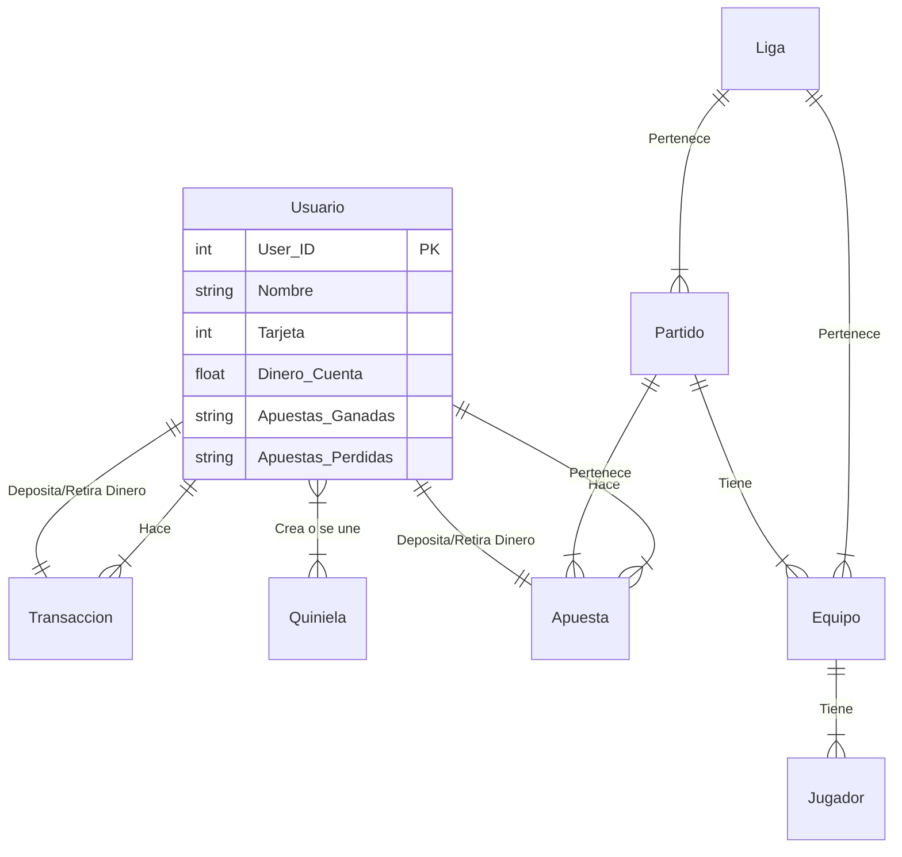

```mermaid
erDiagram
    Usuario ||--|{ Transaccion : Hace
    Usuario }|--|{ Quiniela : "Crea o se une"
    Usuario ||--|{ Apuesta : Hace
    Transaccion ||--|| Usuario : "Deposita/Retira Dinero"
    Apuesta ||--|| Usuario : "Deposita/Retira Dinero"
    Partido ||--|{ Apuesta : Pertenece
    Liga||--|{ Equipo : Pertenece
    Liga||--|{ Partido : Pertenece
    Partido ||--|{ Equipo : Tiene
    Equipo ||--|{ Jugador : Tiene

    Usuario {
        int User_ID PK
        string Nombre
        int Tarjeta
        float Dinero_Cuenta
        string Apuestas_Ganadas
        string Apuestas_Perdidas
    }
```
