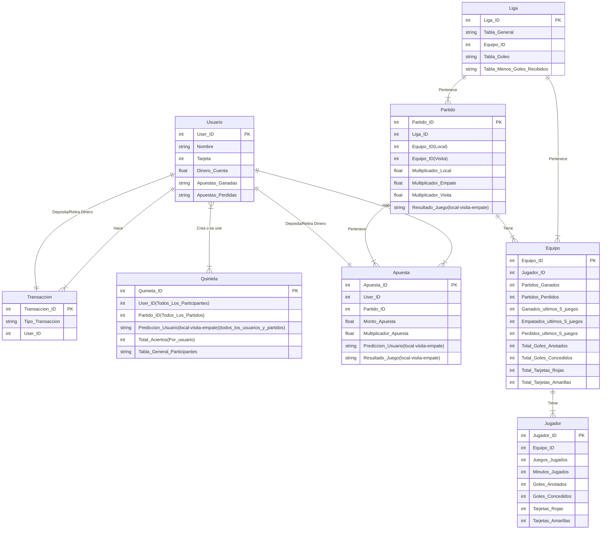

# Tarea #2 Clase BDR MCD
## Instrucciones
1. Convierte tu base de datos no estructurada en un modelo entidad-relacion, representandolo con un diagrama entidad-relacion. Usa nodos con figuras correctas y aristas claramente señaladas con los numeros correspondientes para las relaciones.
2. Muestra el dominio de los atributos.
3. Subir esta descripcion en un archivo markdown.

### 31/01/2024 ACTUALIZACIÓN DE LA TAREA: SE REALIZÓ EL [DIAGRAMA ENTIDAD-RELACIÓN](https://www.figma.com/file/xMHG5oFJbuwDe1O2xPSb91/Diagrama-entidad-relaci%C3%B3n-Tarea_2?type=whiteboard&node-id=0%3A1&t=MjyxMJHcZJcybEsG-1)

### [Página principal](https://github.com/Peque-73/BD-Relacional---Clase-1)