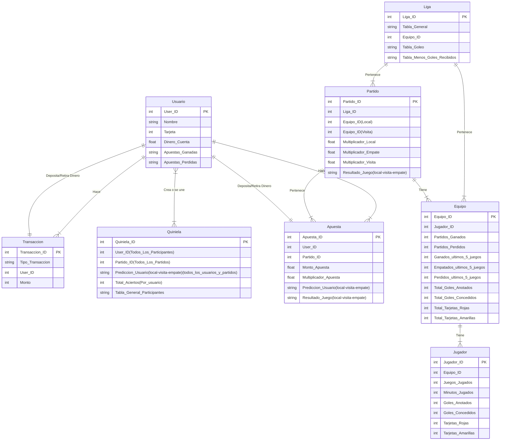

# Tarea #3 Clase BDR MCD
## Instrucciones
1. Crea un esquema del modelo relacional de tu base de datos a partir del modelo relacional de tu base de datos a partir del e-r de la tarea anterior.
2. Representa con un diagrama relacional tu esquema del punto anterior.
3. Encuentra 4 operaciones que vayas a usar en tu base de datos y expresalas mediante operadores del algebra relacional. Explica con tus propias palabras cada una de estas operaciones.
4. Reporta tu tarea de una manera claramente identificable en el repositorio.

## Respuestas

1. A continuación de muestra el esquema de modelo relacional de mi base de datos:  

Usuario (<u>User_ID</u>, Nombre, Tarjeta, Dinero_Cuenta, Apuestas_Ganadas, Apuestas Perdidas)

Tansacción (<u>Transacción_ID</u>, Tipo_Transacción, User_ID)

Quiniela (<u>Quiniela_ID</u>, User_ID, Partido_ID, Predicción_Usuario,Total_Aciertos, Tabla_General_Participantes)

Apuesta (<u>Apuesta_ID</u>, User_ID, Partido_ID, Monto_Apuesta, Predicción_Usuario(Local-Visita-Empate), Resultado_Juego(Local-Visita-Empate))

Equipo (<u>Equipo_ID</u>, Jugador_ID, Partidos_Ganados, Partidos_Perdidos, Ganados_ultimos_5_juegos, Empatados_ultimos_5_juegos, Perdidos_ultimos_5_juegos)

Partido (<u>Partido_ID</u>, Liga_ID, Equipo_ID(Local), Equipo_ID(Visita), Multiplicador_Local, Multiplicador_Empate, Multiplicador_Visita, Resultado)

Jugador (<u>Jugador_ID</u>, Equipo_ID, Juegos_Jugados, Minutos_Jugados, Goles_Anotados, Goles_concedidos, Tarjetas_Rojas, Tarjetas_Amarillas)

Liga (<u>Liga_ID</u>, Tabla_General, Equipo_ID, Tabla_Goleo, Tabla_Menos_Goles_Recibidos)

Usuario_Hace_Transacción (User_ID, Transacción_ID, Tipo de Transacción, Monto)

Transacción_Deposita/Retira_Usuario(User_ID, Transacción_ID, Tipo de Transacción, Monto)

Usuario_Crea/Une_Quiniela(User_ID, Quiniela_ID)

Usuario_Hace_Apuesta(User_ID, Apuesta_ID, Monto_Apuesta)

Apuesta_Deposita/Retira_Usuario(User_ID, Apuesta_ID, Monto)

Apuesta_Pertenece_Partido(Apuesta_ID, Partido_ID)

Partido_Pertenece_Liga(Partido_ID, Liga_ID)

Partido_Tiene_Equipo(Partido_ID, Equipo_ID(Local), Equipo_ID(Visita))

Equipo_Pertenece_Liga(Equipo_ID, Liga_ID)

Equipo_Tiene_Jugador(Equipo_ID, Jugador_ID)

2. A continuación se muestra el diagrama relacional, como en la tarea anterior se me hizo la observación de que hice un diagrama relacional en vez de un diagrama entidad-relación, actualicé la [tarea 2](https://github.com/Peque-73/BD-Relacional---Clase-1/blob/main/Tareas/Tarea_2.md) para que mostrara un diagrama entidad-relación y debajo dejo el diagrama hecho en la clase pasada:

3. A continuación se listan 4 posibles operaciones de hacer:

- $\pi$User_ID, Partido_ID  ($\sigma$ (Monto_Apuesta >= 10,000)  $\hat{}$ (Predicción_Usuario = Resultado_Juego)(Usuario X Apuesta)

La operación anterior nos describe la manera de obtener los ID de los usuarios que han apostado $10,000 o más pesos y han ganado la apuesta y tambien nos obtiene el partido en especifico en el que se hizo la apuesta. De esta manera podemos tener una lista de los usuarios que mas ganancias tienen.

- $\pi$Usuario_ID, Monto  ($\sigma$ (Tipo_Transacción = 'Retiro')  $\hat{}$ (Monto >= 15,000) $\hat{}$ (Apuestas_Ganadas > Apuestas_Perdidas)(Usuario X Transacción)

La operación nos permite tener el ID de los usuarios que tengan retiros por cantidades mayores a $15,000 así como el monto retirado por transacción siempre y cuando el usuario tenga mas apuestas ganadas que perdidas. Esto nos puede servir para detectar usuarios que tal vez no sean de beneficio economico para la pagina ya que ganan más dinero del que pierden, o tal vez podría ser indicador de algún fraude.

- $\pi$Usuario_ID  ($\sigma$ (Apuesta_ID = null)  $\hat{}$ (Dinero_Cuenta = 0)(Usuario X Transacción)

La operacion anterior nos obtiene los ID de los usuarios que no han hecho ninguna apuesta y que no tienen dinero en su cuenta. Esta operación nos puede servir para identificar usuarios inactivos que tal vez solo hicieron una cuenta por curiosidad.

- $\pi$Jugador_ID, Goles_Anotados  ($\sigma$ (Equipo_ID = Equipo_ID(Local))  $\hat{}$ (Goles_Anotados > 0)

La operacion anterior nos permite obtener a los jugadores que han marcado gol y la cantidad de goles que llevan del equipo local. Esto nos puede ser util para mostrar información relevante a los usuarios sobre las apuestas que hicieron.

### [Página principal](https://github.com/Peque-73/BD-Relacional---Clase-1)