# Tarea #3 Clase BDR MCD
## Instrucciones
1. Crea un esquema del modelo relacional de tu base de datos a partir del modelo relacional de tu base de datos a partir del e-r de la tarea anterior.
2. Representa con un diagrama relacional tu esquema del punto anterior.
3. Encuentra 4 operaciones que vayas a usar en tu base de datos y expresalas mediante operadores del algebra relacional. Explica con tus propias palabras cada una de estas operaciones.
4. Reporta tu tarea de una manera claramente identificable en el repositorio.

## Respuestas

1. A continuación de muestra el esquema de modelo relacional de mi base de datos:  

Usuario (<u>User_ID</u>, Nombre, Tarjeta, Dinero_Cuenta, Apuestas_Ganadas, Apuestas Perdidas)

Tansacción (<u>Transacción_ID</u>, Tipo_Transacción, User_ID)

Quiniela (<u>Quiniela_ID</u>, User_ID, Partido_ID, Predicción_Usuario,Total_Aciertos, Tabla_General_Participantes)

Apuesta (<u>Apuesta_ID</u>, User_ID, Partido_ID, Monto_Apuesta, Predicción_Usuario(Local-Visita-Empate), Resultado_Juego(Local-Visita-Empate))

Equipo (<u>Equipo_ID</u>, Jugador_ID, Partidos_Ganados, Partidos_Perdidos, Ganados_ultimos_5_juegos, Empatados_ultimos_5_juegos, Perdidos_ultimos_5_juegos)

Partido (<u>Partido_ID</u>, Liga_ID, Equipo_ID(Local), Equipo_ID(Visita), Multiplicador_Local, Multiplicador_Empate, Multiplicador_Visita, Resultado)

Jugador (<u>Jugador_ID</u>, Equipo_ID, Juegos_Jugados, Minutos_Jugados, Goles_Anotados, Goles_concedidos, Tarjetas_Rojas, Tarjetas_Amarillas)

Liga (<u>Liga_ID</u>, Tabla_General, Equipo_ID, Tabla_Goleo, Tabla_Menos_Goles_Recibidos)

2. A continuación se muestra el diagrama relacional, como en la tarea anterior se me hizo la observación de que hice un diagrama relacional en vez de un diagrama entidad-relación, actualicé la [tarea 2](https://github.com/Peque-73/BD-Relacional---Clase-1/blob/main/Tareas/Tarea_2.md) para que mostrara un diagrama entidad-relación y debajo dejo el diagrama hecho en la clase pasada:

```mermaid
erDiagram
    Usuario ||--|{ Transaccion : Hace
    Usuario }|--|{ Quiniela : "Crea o se une"
    Usuario ||--|{ Apuesta : Hace
    Transaccion ||--|| Usuario : "Deposita/Retira Dinero"
    Apuesta ||--|| Usuario : "Deposita/Retira Dinero"
    Partido ||--|{ Apuesta : Pertenece
    Liga||--|{ Equipo : Pertenece
    Liga||--|{ Partido : Pertenece
    Partido ||--|{ Equipo : Tiene
    Equipo ||--|{ Jugador : Tiene

    Usuario {
        int User_ID PK
        string Nombre
        int Tarjeta
        float Dinero_Cuenta
        string Apuestas_Ganadas
        string Apuestas_Perdidas
    }
Transaccion {
        int Transaccion_ID PK
        string Tipo_Transaccion
        int User_ID
    }

    Apuesta {
            int Apuesta_ID PK
            int User_ID
            int Partido_ID
            float Monto_Apuesta
            float Multiplicador_Apuesta
            string Prediccion_Usuario(local-visita-empate)
            string Resultado_Juego(local-visita-empate)
    }

    Equipo {
        int Equipo_ID PK
        int Jugador_ID
        int Partidos_Ganados
        int Partidos_Perdidos
        int Ganados_ultimos_5_juegos
        int Empatados_ultimos_5_juegos
        int Perdidos_ultimos_5_juegos
        int Total_Goles_Anotados
        int Total_Goles_Concedidos
        int Total_Tarjetas_Rojas
        int Total_Tarjetas_Amarillas
    }

    Liga {
        int Liga_ID PK
        string Tabla_General
        int Equipo_ID
        string Tabla_Goleo
        string Tabla_Menos_Goles_Recibidos
    }

    Jugador {
        int Jugador_ID PK
        int Equipo_ID
        int Juegos_Jugados
        int Minutos_Jugados
        int Goles_Anotados
        int Goles_Concedidos
        int Tarjetas_Rojas
        int Tarjetas_Amarillas
    }

    Partido {
        int Partido_ID PK
        int Liga_ID
        int Equipo_ID(Local)
        int Equipo_ID(Visita)
        float Multiplicador_Local
        float Multiplicador_Empate
        float Multiplicador_Visita
        string Resultado_Juego(local-visita-empate)
    }

    Quiniela {
        int Quiniela_ID PK
        int User_ID(Todos_Los_Participantes)
        int Partido_ID(Todos_Los_Partidos)
        string Prediccion_Usuario(local-visita-empate)(todos_los_usuarios_y_partidos)
        int Total_Aciertos(Por_usuario)
        string Tabla_General_Participantes
    }
```

